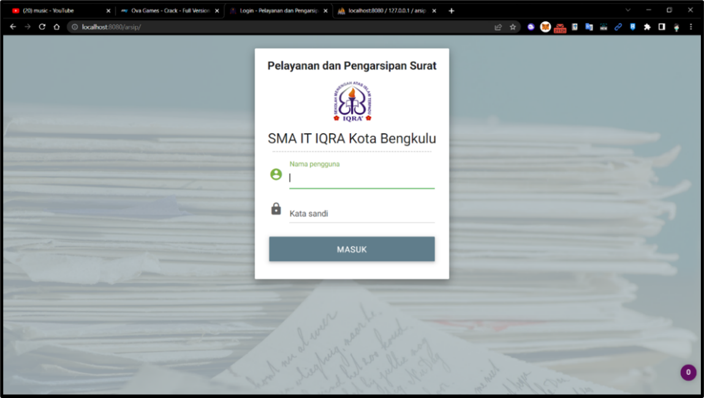
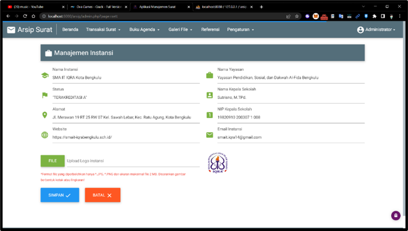

## SISTEM INFORMASI ARSIP SURAT
Sistem Informasi Pelayanan dan Pengarsipan Surat Berbasis Web di SMAIT IQRA Kota Bengkulu adalah sebuah sistem yang dirancang untuk mempermudah proses pengelolaan surat dan arsip secara digital. Sistem ini memungkinkan pengguna, seperti staf administrasi sekolah, untuk mengelola surat masuk dan keluar, menyimpan arsip surat secara terorganisir, serta melakukan pencarian surat dengan cepat dan efisien. Fitur utama dari sistem ini meliputi:

1. **Manajemen Surat Masuk dan Keluar**: Memudahkan pencatatan dan pengelolaan surat yang diterima dan dikirim oleh sekolah.
2. **Pengarsipan Digital**: Surat-surat dapat disimpan dalam format digital sehingga lebih mudah diakses dan dicari.
3. **Pencarian Arsip**: Memungkinkan pengguna untuk mencari surat tertentu berdasarkan kriteria seperti tanggal, nomor surat, pengirim, dan lain-lain.
4. **Keamanan Data**: Menjamin kerahasiaan dan integritas data surat dengan fitur akses terbatas bagi pengguna yang berwenang.
5. **Pelaporan**: Membuat laporan terkait surat masuk dan keluar serta status pengarsipan.

Sistem ini bertujuan untuk meningkatkan efisiensi dan efektivitas pengelolaan administrasi surat di SMAIT IQRA Kota Bengkulu, menggantikan metode manual yang rentan terhadap kesalahan dan kehilangan data.

## TAMPILAN SISTEM INFORMASI

 

 

 

 

 

 

 
## INSTALASI SOURCE CODE
- Ekstrak source code
- Unggah ke local host
- Jika menggunakan xampp copy ke dalam folder htdocs
- Buat database baru dengan nama databenya
- import file nama_database.sql yang ada di folder db ke dalam database yang dibuat tadi
- Buka browser lalu jalankan dengan menuliskan localhost/namaweb
  
## Akun Super Admin
- user	: admin 
- pass	: admin

## Akun administrator
- user : alaninformatika
- pass : 123456

 

 

